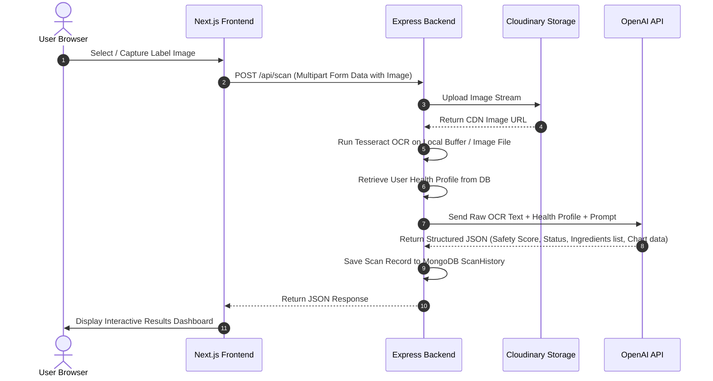

# RESEARCH.md — Project Technical Research

> **Phase**: `0 (Pre-planning & Architecture)`
> **Researched at**: 2026-05-21
> **Discovery Level**: `2 (Standard research & Architectural design)`

## Objective
Establish the technical architecture, library choices, data flows, and integration designs for Safebite AI based on the user-selected modern full-stack web technology stack.

---

## Key Decisions

### Decision 1: Tailwind CSS v4 Integration in Next.js
* **Question:** How do we configure and utilize Tailwind CSS v4 since it represents a major rewrite from v3?
* **Options Considered:**
  1. **Standard Tailwind v4 CSS-First configuration:** Direct import in `global.css` via `@import "tailwindcss";` utilizing Vite/Next.js plugins without `tailwind.config.js`.
  2. **Traditional PostCSS configuration:** Standard v3 structure but forced to v4.
* **Decision:** **Option 1 (CSS-First Tailwind v4 configuration)**. In Next.js, we will use the official Tailwind CSS v4 setup. Themes and customizations will be specified inside `global.css` using CSS custom properties (e.g. `@theme { --color-primary: #10b981; }`) instead of a traditional `tailwind.config.js`.
* **Confidence:** High.

### Decision 2: OCR Location (Client vs. Server-Side)
* **Question:** Should Tesseract OCR be performed client-side in Next.js or server-side in Node.js/Express?
* **Options Considered:**
  1. **Client-side with `tesseract.js`:** The browser handles image decoding and text extraction, sending only the extracted raw text to the backend. This reduces server CPU consumption and saves bandwidth.
  2. **Server-side with Multer, Cloudinary, and Tesseract:** The user uploads the image via Multer to the Express server, which uploads to Cloudinary, and the Express server executes the OCR parsing.
* **Decision:** **Option 2 (Server-side with Multer, Cloudinary, and Tesseract)**. This fits the user's specific architectural requirement. It allows the server to keep a high-quality copy of the image in Cloudinary, perform OCR parsing asynchronously or synchronously, and securely run the OpenAI API analysis without exposing secret API keys to the client.
* **Confidence:** High.

### Decision 3: State Management & Chart Rendering
* **Question:** How should the frontend handle radar chart visualization and dark/light modes?
* **Options Considered:**
  1. **Recharts with Tailwind integration:** A standard declarative React charting library that easily styles with Tailwind CSS.
  2. **Chart.js / React-Chartjs-2:** Powerful but heavy with canvas-based rendering.
* **Decision:** **Option 1 (Recharts)**. It integrates beautifully with Next.js, React, and Tailwind CSS, and works seamlessly with standard responsive viewport containers.
* **Confidence:** High.

---

## Architecture & Technical Flow

### 1. Data Schema Design (MongoDB / Mongoose)

We will define three main models:
* **User Model**:
  ```typescript
  {
    email: { type: String, required: true, unique: true },
    password: { type: String }, // Optional for Google OAuth users
    googleId: { type: String },
    name: { type: String, required: true },
    healthProfile: {
      diabetes: { type: Boolean, default: false },
      highBloodPressure: { type: Boolean, default: false },
      heartDisease: { type: Boolean, default: false },
      allergies: [{ type: String }], // Array of specific allergen names (e.g., peanut, dairy, gluten)
      obesity: { type: Boolean, default: false },
      lactoseIntolerance: { type: Boolean, default: false },
      kidneyDisease: { type: Boolean, default: false },
      highCholesterol: { type: Boolean, default: false },
      glutenIntolerance: { type: Boolean, default: false },
      otherRestrictions: { type: String }
    },
    createdAt: { type: Date, default: Date.now }
  }
  ```
* **ScanHistory Model**:
  ```typescript
  {
    userId: { type: mongoose.Schema.Types.ObjectId, ref: 'User', required: true },
    imageUrl: { type: String, required: true }, // Cloudinary CDN URL
    extractedText: { type: String }, // Raw Tesseract output
    analysis: {
      safetyStatus: { type: String, enum: ['GREEN', 'YELLOW', 'RED'], required: true },
      safetyScore: { type: Number, min: 0, max: 100, required: true },
      harmfulIngredients: [{
        name: { type: String },
        reason: { type: String }
      }],
      nutritionalRisks: [{
        nutrient: { type: String },
        value: { type: String },
        warning: { type: String }
      }],
      personalizedWarnings: [{ type: String }],
      healthierRecommendations: [{ type: String }],
      chartData: [{
        subject: { type: String }, // e.g. Sodium, Sugar, Fats, Protein, Fiber
        value: { type: Number },
        fullMark: { type: Number }
      }]
    },
    createdAt: { type: Date, default: Date.now }
  }
  ```

### 2. Scanning & Analysis Pipeline (Real-Time Mock / API Flow)



---

## Patterns to Follow
- **Structured JSON with OpenAI:** Always request JSON response structures from the OpenAI API (`response_format: { type: "json_object" }`) using specific schemas to ensure parsing doesn't crash the Node.js backend.
- **Tailwind CSS v4 Utility Classes:** Use standard CSS custom properties inside `globals.css` and use tailwind classes natively in the shadcn/ui components.
- **Stateless JWT + Passport.js:** Store JWT tokens in secure, `httpOnly` cookies rather than local storage to mitigate XSS vulnerabilities.

## Anti-Patterns to Avoid
- **Client-Side API Keys:** Never expose OpenAI or Cloudinary upload secrets directly in Next.js environment variables prefixed with `NEXT_PUBLIC_`.
- **Synchronous Blocking OCR:** Avoid executing OCR on the main thread if processing heavy images. Run OCR efficiently using stream pipelines or optimized buffers.

## Dependencies Identified
| Package | Role | Purpose |
|---------|------|---------|
| `openai` | Node Library | Connect to OpenAI API for health food analysis |
| `tesseract.js` or `node-tesseract-ocr` | OCR Engine | Extract text from ingredient labels |
| `multer` / `multer-storage-cloudinary` | File Upload | Handle incoming multipart form data |
| `cloudinary` | Storage | Store original scanned package labels in cloud |
| `passport` / `passport-jwt` | Auth | Secure user authentication and routes |
| `framer-motion` | Motion | UI transitions, analysis loading states |
| `recharts` | Charting | Draw interactive safety radar charts |

## Risks & Mitigation
* **Risk 1:** OCR failure due to bad lighting, bent packaging, or poor camera resolution.
  * *Mitigation:* The backend prompt instructs the AI to treat empty or low-quality OCR results gracefully, prompting the user with a helpful message to "Please try capturing a flatter, well-lit surface". We will also display the raw extracted text in a collapsible debug section to show transparency.
* **Risk 2:** AI Hallucination regarding severe health risks (e.g. telling a diabetic high-sugar foods are green).
  * *Mitigation:* Ensure highly precise system instructions to the OpenAI model, mandating conservative health ratings. We enforce a robust, omnipresent global disclaimer stating that assessments are strictly informative.

---

## Recommendations for Planning
1. **Phase 1: Foundation Setup** (Setup repos, databases, configure Next.js with Tailwind v4, Express server with Passport/JWT authentication boilerplate).
2. **Phase 2: Health Profile & Dashboard** (Implement frontend & backend routes for registration, health profile checkboxes, scan history logs).
3. **Phase 3: OCR & Image Upload Integration** (Configure Multer, Cloudinary, and Tesseract server-side, verifying local processing pipelines).
4. **Phase 4: OpenAI Integration & Traffic Indicator** (Send prompt containing OCR text and user profile to OpenAI, parsing JSON, rendering Green/Yellow/Red indicators and Recharts charts).
5. **Phase 5: Refinement, Dark/Light Mode, & Polishing** (Add micro-animations with Framer Motion, polish styling, and add sticky medical disclaimer).
